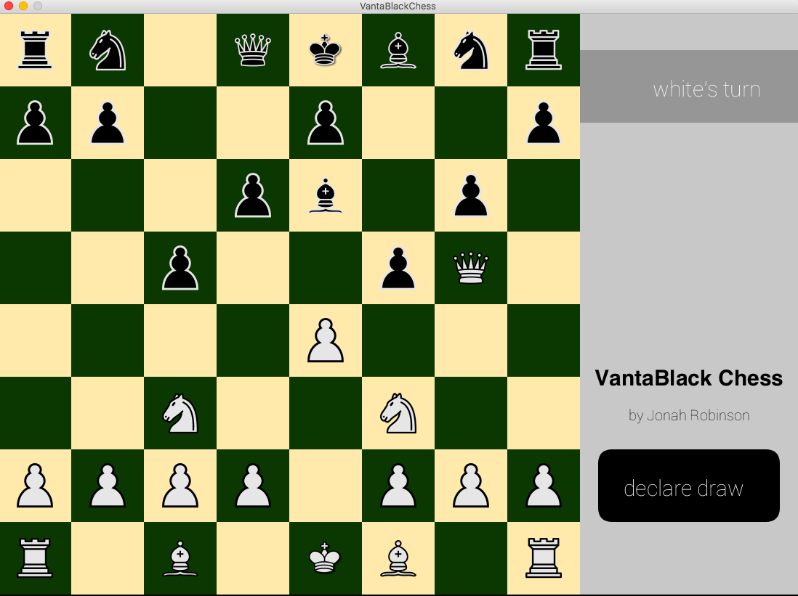

# Chess
My chess game known as Vanta Black Chess is a fully playable two-person chess game. Both black and white are human controlled, there is no AI component. All standard chess rules apply including castling and pawn promotion. When selecting a piece, the game will automatically check all possible legal moves and highlight them in red. The game can detect check mates and stale mates but not draws which must be manually declared. The game can be reset without restarting the program. 



# Dependencies
The entire program is written in Processing 3. If you don’t already have Processing you can download for free here: https://processing.org/download/. This program only uses one external library: processing.sound.

# Usage
Clone or download my code. From you computer you can play the game by opening one of the .pde files and pressing the play button in the Processing environment. You can also the export the application as a double-clickable executible on Mac or PC by pressing File/Export Application in the Processing evnironment.

# Code Explaination

## Drawing the board
Standard chess boards have 64 squares in 8 rows and 8 collumns. Therefore I created a Square class with each object acting as one square on a chessboard. I then created a 2D array of Square of length 8 by 8. 
```processing
squares = new Square[8][8];
```
The Square class has a x and y variable to display it's position. Rect mode is set to corner. horz describes the horizontal coordinate of the square (from 0 to 7) and vert describes the vertical coordiante of the square (from 0 to 7). squareColor is either "black" or "white". The occupiedPiece is the index of the piece that occupies a square, it's -1 if the square is unoccupied. OccupiedColor tells the color of the piece that occupies a square, "black", "white", or "none" if the piece is unoccupied.

```processing
class Square {
  int x, y;
  int horz, vert;
  String squareColor;
  color Color;
  int textColor;
  int occupiedPiece;
  String occupiedColor;
  boolean pieceBeingTaken;
  Square(int x, int y, int horz, int vert, String squareColor, int occupiedPiece, String occupiedColor) {
    this.x = x;
    this.y = y;
    this.horz = horz;
    this.vert = vert;
    this.squareColor = squareColor;
    this.occupiedPiece = occupiedPiece;
    this.occupiedColor = occupiedColor;
    pieceBeingTaken = false;
  

    if (squareColor.equals("black")) {
      Color = color(11, 56, 1);
      textColor = 255;
    } else if (squareColor.equals("white")) {
      Color = color(255, 234, 171);
      textColor = 0;
    }
  }
  ```
  This is the initialization of squares:
  ```processing
  for(int h = 0; h < 8; h++){
    for(int v = 0; v < 8; v++){
      squares[h][v] = new Square(100 * h, 100 * v, h, v, decideSquareColor(h,v),
      decideOccupiedPiece(h,v), decideOccupiedColor(v));
    }
  }
  ```
  decideSquareColor is a function that decides the color of a Square based on its horizontal and vertical coordinates:
  ```processing
  String decideSquareColor(int h, int v){
  if(h%2 == 0){
    if(v%2==0){
      return "white";
    }else{
      return "black";
    }
  }else{
    if(v%2==0){
      return "black";
    }else{
      return "white";
    }
  }
}
 ```
decideOccupiedColor decides the occupiedColor of a Square based on its vertical coordinate and decideOccupiedPiece decides the occupiedPiece of a Square based on is horizontal and vertical coordinates:
```processing
String decideOccupiedColor(int v){
  if(v == 0 || v == 1){
    return "black";
  }else if(v == 6 || v == 7){
    return "white";
  }else{
    return "none";
  }
}

int decideOccupiedPiece(int h, int v){
 if(v == 0 || v == 7){
    return h + 8;
  }else if(v == 1 || v == 6){
    return h;
  }else{
    return -1;
  }
}
```
The display method is used to display a Square. 
```processing
void display() {
    noStroke();
    fill(Color);
    rect(x, y, 100, 100); 
  }
```
After the Square objects in squares are initialized, they can be displayed using the display method in the void draw section of the code. 
```processing
for(int h = 0; h < 8; h++){
    for(int v = 0; v < 8; v++){
      squares[h][v].display();
    }
   }
```
## The Piece Class
The Piece class represents different chess pieces. Each piece has an x and y variable to display its position. Like the Square class, each Piece has a horizontal coordinate called horz and a vertical coordinate called vert. horz and vert for each Piece correlate to the square the piece is on. pieceColor is whether a piece is "black" or "white". The variable called type is what each piece is: a pawn, rook, knight, bishop, king or queen. image is the appropriate image for a particular type and color of a piece. The boolean alive is whether or not a piece is currently in the game. When a piece is taken, alive is set to false. materialValue is the value of a piece: 1 for pawns, 3 for knights and bishops, 5 for rooks, and 9 for queens. pieceHasNotMoved is a boolean that represents whether a not a piece has moved in the current game. It is used with rooks and kings to check whether castling is allowed. 
```processing
class Piece{
  int x,y;
  int horz,vert;
  String pieceColor;
  String type;
  PImage image;
  boolean alive;
  int index;
  int materialValue;
  boolean pieceHasNotMoved;
  Piece(int x, int y, int horz, int vert, String pieceColor, String type, int index){
    this.x = x;
    this.y = y;
    this.horz = horz;
    this.vert = vert;
    this.pieceColor = pieceColor;
    this.type = type;
    this.index = index;
    alive = true;
    pieceHasNotMoved = true;
    this.setImages();
    
  }
```
In order to represent all 32 pieces on a chess board, a 2D array of Piece of size 2 by 16 is used. The first index represents pieceColor, while the second index represents the exact piece(rook on one side of the board, pawn in a certain position ect.). I arbitralily decided to represent white pieces with index 0 and black pieces with index 1. 
```processing
pieces = new Piece[2][16];
```
All 32 pieces are initiated as follows. This will space each piece properly, give them the correct type and color, and give them correct indexes. 
```processing
for(int i = 0; i<8; i++){
    pieces[0][i] = new Piece(i * 100 + 50, 650, i, 6, "white", "pawn",i);
  }
  pieces[0][8] = new Piece(50,750,0,7,"white", "rook",8);
  pieces[0][9] = new Piece(150,750,1,7,"white", "knight",9);
  pieces[0][10] = new Piece(250,750,2,7,"white", "bishop",10);
  pieces[0][11] = new Piece(350,750,3,7,"white", "queen",11);
  pieces[0][12] = new Piece(450,750,4,7,"white", "king",12);
  pieces[0][13] = new Piece(550,750,5,7,"white", "bishop",13);
  pieces[0][14] = new Piece(650,750,6,7,"white", "knight",14);
  pieces[0][15] = new Piece(750,750,7,7,"white", "rook",15);
  
  for(int i = 0; i<8; i++){
    pieces[1][i] = new Piece(i * 100 + 50, 150, i, 1, "black", "pawn",i);
  }
  pieces[1][8] = new Piece(50,50,0,0,"black", "rook",8);
  pieces[1][9] = new Piece(150,50,1,0,"black", "knight",9);
  pieces[1][10] = new Piece(250,50,2,0,"black", "bishop",10);
  pieces[1][11] = new Piece(350,50,3,0,"black", "queen",11);
  pieces[1][12] = new Piece(450,50,4,0,"black", "king",12);
  pieces[1][13] = new Piece(550,50,5,0,"black", "bishop",13);
  pieces[1][14] = new Piece(650,50,6,0,"black", "knight",14);
  pieces[1][15] = new Piece(750,50,7,0,"black", "rook",15);
```
The simple display function displays a Piece. 
```processing
void display(){
    if(alive){
      image(image,x,y);
    }
  }
```
Which can then be called in the draw method. 
```processing
for(int i = 0; i<16; i++){
     pieces[0][i].display();
     pieces[1][i].display();
   }
```
The main driver of the game flow is mouse clicks. Therfore a useful boolean function is the mouseHover which will return true if the mouse is over a particular rectangle based on the rectangles x and y position, and x and y size. It should be noted this function assumes rect or image mode to be CENTER. 
```processing
boolean mouseHover(int x, int y, int xSize, int ySize){
  if(mouseX > x && 
  mouseX < x + xSize &&
  mouseY > y &&
  mouseY <  y + ySize){
    return true;
  }else{
    return false;
  }
}
```

With every mouse click, all 64 square objects in Squares will run a method called checkForClick(). 
```processing
void mousePressed(){
  for(int h = 0; h < 8; h++){
    for(int v = 0; v < 8; v++){
      squares[h][v].checkForClick();
    }
```
For starters it's worth noting that checkForClick has an initial conditional statement using mouseHover(), this means that even though checkForClick() is run for every square it will effectively only check one square: the one the player has clicked on. 
```processing
void checkForClick() {
    if (mouseHover(x, y, 100, 100)) {
     
```
Following the mouseHover check there is an if else stament that will check through several conditions. First if the square is a occupied by white piece and the turn is 0 (aka it's white to move). Second if the square is occupied by a black piece and turn is 1( aka it's black to move) and finally if neither of these conditions are met but the square selected is still occupied. 
```processing
if(occupiedColor.equals("white") && turn == 0){
        if(pieceSelected == occupiedPiece){
          pieceSelected = -1;
          resetSquareColors();
        }else{
          pieceSelected = occupiedPiece;
          showPossibleMoves();
        }
      }else if(occupiedColor.equals("black") && turn == 1){
        if(pieceSelected == occupiedPiece){
          pieceSelected = -1;
          resetSquareColors();
        }else{
          pieceSelected = occupiedPiece;
          showPossibleMoves();
        }
      }
      else if(pieceSelected != -1){
    ```
